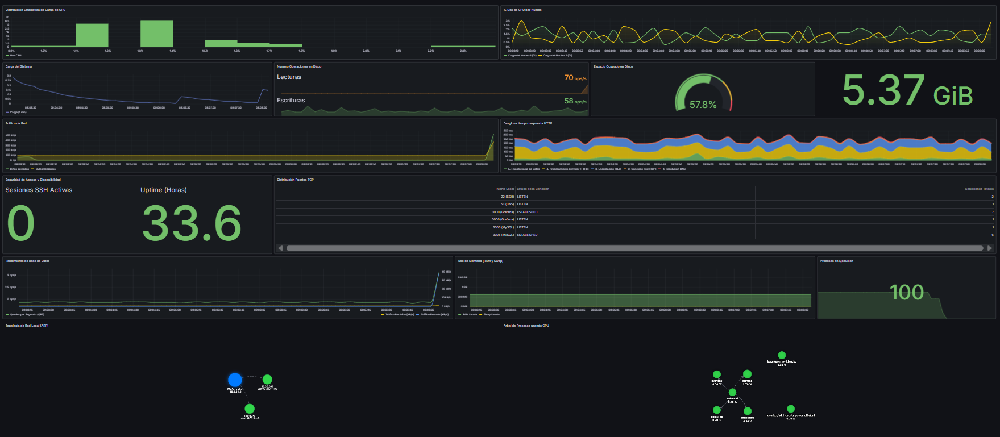

# Enterprise Linux Observability & Chaos Engineering

<div align="center">
  
  
  
  
  
  
  

</div>

> **ABOUT THIS PROJECT:**
> This repository contains a custom-built **Telemetry Agent and Observability Stack** designed to monitor Linux OS performance, dynamic network topologies, and database health in real-time. 
> 
> Unlike standard out-of-the-box exporters, this system implements a native Python daemon directly integrated with `systemd`, paired with a **Chaos Engineering** testing suite to simulate and visualize critical infrastructure bottlenecks.

<div align="center">
  
</div>

---

## 🏗️ Architecture & Key Features

* **Custom `systemd` Daemon:** The Python agent (`system_monitor.py`) runs as a highly available background service, ensuring automated recovery and continuous telemetry data ingestion into a relational database.
* **Deep OS & Hardware Metrics:** Tracks precise CPU/Core loads, RAM/Swap usage boundaries, Disk I/O operations, and system load averages (`psutil`).
* **Dynamic Network Topology (ECharts):** Dynamically extracts the OS ARP table and maps local network nodes. Monitors all active TCP socket states (LISTEN vs. ESTABLISHED).
* **Advanced Application Telemetry:** * Breaks down **HTTPS response latency** across all network layers (DNS, TCP handshake, TLS negotiation, TTFB, and Transfer).
  * Extracts internal **MariaDB/MySQL health metrics** (Queries Per Second, TX/RX Bandwidth, Active Threads).
* **Chaos Engineering Suite:** Includes 6 specialized Bash scripts to simulate high-load operational scenarios (CPU saturation, RAM swap-thrashing, Network I/O spikes, and Database concurrency overload).

---

## 📂 Project Structure

```text
Linux-Observability-Agent
 ┣ 📂 assets/
 ┃ ┣ 🖼️ dashboard.png
 ┣ 📂 docs/
 ┃ ┣ 📜 presentation_slides.pdf
 ┃ ┗ 📜 technical_report.pdf
 ┣ 📂 src/
 ┃ ┗ 🐍 system_monitor.py
 ┗ 📂 stress-tests/
   ┣ 📜 stress_cpu.sh
   ┣ 📜 stress_disk.sh
   ┣ 📜 stress_mysql.sh
   ┣ 📜 stress_network.sh
   ┣ 📜 stress_processes.sh
   ┗ 📜 stress_ram.sh
```

---

## Getting Started

### 1. Database & Environment Setup
Ensure MariaDB/MySQL is installed. The agent requires a database named `ESI_Practica1` and a user with write privileges:

```sql
CREATE DATABASE ESI_Practica1;
-- Refer to the technical_report.pdf in /docs for the exact SQL Table schemas.
```

### 2. Deploying the Telemetry Agent
Install the required Python dependencies:

```bash
pip3 install psutil mysql-connector-python
```

To run the agent as a native Linux service, map it to systemd (optional but recommended for production-like environments):

```bash
sudo cp src/system_monitor.py /opt/
sudo systemctl enable monitor.service
sudo systemctl start monitor.service
```

### 3. Visualizing Data (Grafana)
Connect your Grafana instance to the MariaDB database. The telemetry agent updates the historical tables (Time-Series) and truncates the dynamic tables (for ECharts Network Topology) every 60 seconds.

---

## Chaos Engineering (Stress Tests)

You can validate the resilience of the observability stack and trigger visual spikes in the Grafana dashboards by executing the stress testing suite.

Before running, grant execution permissions:

```bash
cd stress-tests/
chmod +x *.sh
```

**Example: Simulating a Database Concurrency Overload**
This will simulate 50 concurrent users blasting the database with SQL queries, spiking the QPS (Queries Per Second) panel.

```bash
./stress_mysql.sh
[*] Preparing MySQL/MariaDB stress test...
Enter the database password for user 'elliot': 
[*] Launching mysqlslap (50 concurrent connections, 10 iterations)...
[✔] Database test completed.
```

---

### 👨‍💻 Authors

Iván Moro Cienfuegos, Pablo March Ortega and Nicolás Reyes Gutiérrez
